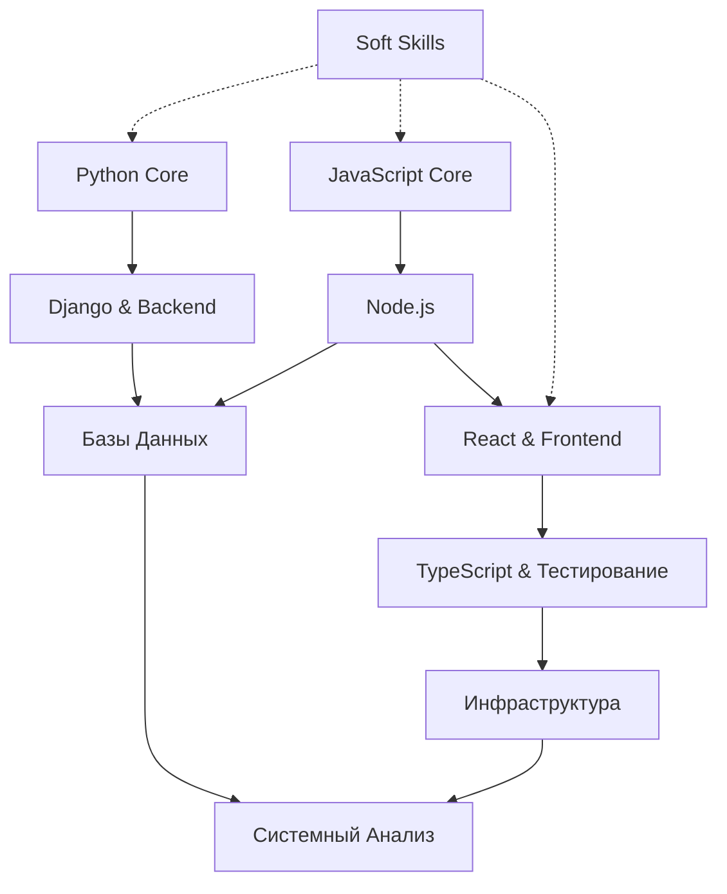

# 📚 Каталог тем для подготовки к собеседованию

> **Назначение:** Этот файл служит навигационным центром всей библиотеки знаний. Темы сгруппированы по категориям для систематизированной подготовки.

---

## 📋 Структура каталога

```
📁 Собеседование/
├── 📄 00_КАТАЛОГ_ТЕМ.md                    # Главный каталог
├── 📄 01_Python_Backend_INDEX.md           # Индекс Python
├── 📄 02_JavaScript_NodeJS_INDEX.md        # Индекс JavaScript
├── 📄 03_React_Frontend_INDEX.md           # Индекс React
├── 📄 04_Databases_INDEX.md                # Индекс БД
├── 📄 05_Infrastructure_SystemDesign_INDEX.md  # Индекс Инфраструктура
├── 📄 99_ШПАРГАЛКА_ВОПРОСЫ.md              # Шпаргалка
│
├── 📁 01_Python_Backend/                   # Python & Backend
├── 📁 02_JavaScript_NodeJS/                # JavaScript & Node.js
├── 📁 03_React_Frontend/                   # React & Frontend
├── 📁 04_Databases/                        # Базы Данных
├── 📁 05_Infrastructure/                   # Инфраструктура
└── 📁 06_Soft_Skills/                      # Soft Skills
```

---

## 🔰 1. Python Core

| Файл | Темы |
|------|------|
| [[01_Python_Backend/01_Python_Core]] | Типы данных, мутабельность, структуры данных, функции, ООП, память, GIL |
| [[01_Python_Backend/02_Django_REST_API]] | MVT, ORM, оптимизация, Middleware, DRF, сериализаторы, аутентификация |
| [[01_Python_Backend/03_Web_Servers_Quality]] | Кэширование, WSGI/ASGI, WebSockets, Django Channels, PEP 8, TDD |

---

## ⚡ 2. JavaScript Core & Node.js

| Файл | Темы |
|------|------|
| [[02_JavaScript_NodeJS/01_JavaScript_Core_EventLoop]] | Event Loop (браузер + Node.js), Call Stack, замыкания, контекст, Redux/Zustand |
| [[02_JavaScript_NodeJS/02_Advanced_JS_LiveCoding]] | Live-coding (debounce, throttle, curry), Promise, события, Garbage Collector |
| [[02_JavaScript_NodeJS/03_NodeJS_Streams_Network]] | Streams, Backpressure, Event Loop фазы, Worker Threads, WebSockets, SSE |
| [[02_JavaScript_NodeJS/04_NodeJS_Threads_Queues]] | Многопоточность, очереди (BullMQ, Kafka), Event Emitter, микросервисы |

---

## ⚛️ 3. React & Frontend Architecture

| Файл | Темы |
|------|------|
| [[03_React_Frontend/01_React_Architecture_FSD]] | RSC, Client Components, FSD слои, Zustand, AST-анализ |
| [[03_React_Frontend/02_React_Internals_Optimization]] | Virtual DOM, React Fiber, HOC, Portals, Lazy Loading, Shimmer UI |
| [[03_React_Frontend/03_NextJS_App_Router_React19]] | 4 уровня кэширования, Server Actions, хуки React 19, виртуализация |
| [[03_React_Frontend/04_NextJS_RSC]] | RSC vs SSR, гидратация, индексы кэширования |

---

## 🗄️ 4. Базы Данных

| Файл | Темы |
|------|------|
| [[04_Databases/01_Databases_ORM_SQL]] | SQL основы, ACID, уровни изоляции, индексы, JOIN, Drizzle, IndexedDB |
| [[04_Databases/02_Database_Optimization_N1]] | Проблема N+1, DataLoader, B-Tree, транзакции, Core Web Vitals |
| [[04_Databases/03_Advanced_Database_Offline]] | PostgreSQL JSONB, CTE, оффлайн-синхронизация, паттерны ООП |

---

## 🌐 5. Инфраструктура & System Design

| Файл | Темы |
|------|------|
| [[05_Infrastructure/01_Infrastructure_Networks_Docker]] | Docker, Git, HTTP, REST, JWT, SOLID, MVC |
| [[05_Infrastructure/02_System_Analysis_BPMN_UML]] | BPMN, IDEF0, UML, AI в разработке, SDLC |
| [[05_Infrastructure/03_TypeScript_Security_Testing]] | TypeScript, OWASP (XSS, SQLi, CORS), пирамида тестирования |

---

## 🤝 6. Soft Skills

| Файл | Темы |
|------|------|
| [[06_Soft_Skills/01_Agile_Scrum]] | Agile, Scrum (спринт, артефакты, ритуалы) |

---

## 📊 Карта взаимосвязей тем



---

## 🎯 Рекомендованный порядок изучения

### Для Fullstack-разработчика (Python + JavaScript)

1. **Неделя 1-2:** [[01_Python_Backend/01_Python_Core]] → [[01_Python_Backend/02_Django_REST_API]]
2. **Неделя 3-4:** [[04_Databases/01_Databases_ORM_SQL]] → [[04_Databases/02_Database_Optimization_N1]]
3. **Неделя 5-6:** [[02_JavaScript_NodeJS/01_JavaScript_Core_EventLoop]] → [[02_JavaScript_NodeJS/02_Advanced_JS_LiveCoding]]
4. **Неделя 7-8:** [[03_React_Frontend/01_React_Architecture_FSD]] → [[03_React_Frontend/02_React_Internals_Optimization]]
5. **Неделя 9-10:** [[03_React_Frontend/03_NextJS_App_Router_React19]] → [[05_Infrastructure/03_TypeScript_Security_Testing]]
6. **Неделя 11-12:** [[05_Infrastructure/01_Infrastructure_Networks_Docker]] → [[05_Infrastructure/02_System_Analysis_BPMN_UML]]

### Для углублённой подготовки

- **Backend фокус:** Python → Django → Базы Данных → Node.js Streams → Инфраструктура
- **Frontend фокус:** JavaScript → React → Next.js → TypeScript → FSD → Оптимизация
- **System Design:** Базы Данных → Паттерны → Инфраструктура → Системный анализ

---

## 📝 Заметки

- Все файлы связаны между собой через внутренние ссылки Obsidian
- Для быстрого поиска используйте `Ctrl/Cmd + O` и вводите название темы
- Темы с пометкой **"Под капотом"** содержат углублённые технические детали
- Файлы с **Live-Coding** требуют практической отработки на доске/в редакторе

---

## 🔗 Быстрые ссылки на индексы

| Категория | Индексный файл |
|-----------|---------------|
| 🐍 Python & Backend | [[01_Python_Backend_INDEX]] |
| ⚡ JavaScript & Node.js | [[02_JavaScript_NodeJS_INDEX]] |
| ⚛️ React & Frontend | [[03_React_Frontend_INDEX]] |
| 🗄️ Базы Данных | [[04_Databases_INDEX]] |
| 🌐 Инфраструктура | [[05_Infrastructure_SystemDesign_INDEX]] |
| 📝 Шпаргалка | [[99_ШПАРГАЛКА_ВОПРОСЫ]] |

---

*Последнее обновление: 17 марта 2026*
